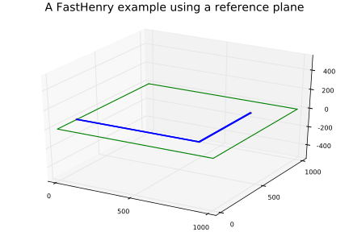

# Example 1: A simple example from the FastHenry documentation.

This example is a recreation of the example in section 1.2 of "[FastHenry User's Guide](https://github.com/ediloren/FastHenry2/blob/master/doc/FastHenry_User_Guide.pdf)" using FastHeneryHelper.

load the module
```@example 1
using FastHenryHelper
```

Create a group of FastHenry elements for FastHenry to compute the loop inductance of an L shaped trace over a ground plane with the trace's return path through the plane.
```@example 1
title = Title("A FastHenry example using a reference plane")
u = Units("mils")
nin = Node("in",800,800,0)
nout = Node("out",0,200,0)
g = UniformPlane(x1=0,    y1=0,    z1=0,
				 x2=1000, y2=0,    z2=0,
				 x3=1000, y3=1000, z3=0,
    			 thick= 1.2,
    			 seg1=20, seg2=20,
    			 nodes=[nin, nout])
d = Default(SegmentParameters(sigma=62.1e6*2.54e-5,nwinc=8, nhinc=1))
n1 = Node("1",0,200,1.5)
n2 = Node(800,200,1.5)
n3 = Node(800,800,1.5)
sp = SegmentParameters(w=8,h=1)
s1 = Segment(n1,n2,sp)
s2 = Segment(n2,n3,sp)
eq = Equiv([nin,n3])
ex = External(n1,nout)
f = Freq(min=1e-1, max=1e9, ndec=0.05)
e = End()
example1 = Group([title;u;g;d;n1;n2;n3;s1;s2;eq;ex;f;e])
```

Write example1 to a file.
```@example 1
open("example1.inp","w") do io
    show(io,example1)
end
```

Groups may be transformed.  To demonstrate, example1 is rotated 90deg around x,y,and z axis.
```@example 1
transform!(example1,rx(0.5π)*ry(0.5π)*rz(0.5π))  # must keep plane parallel to xy, xz, or yz plane
```

Write rotated example1 to a file
```@example 1
open("example1_rotated.inp","w") do io
    show(io,example1)
end
```

Groups may also be built with push!.
```@example 1
# same example, using push!
# same example, using push!
example1 = Group()
push!(example1,Title("A FastHenry example using a reference plane"))
push!(example1,Units("mils"))
nin = Node("in",800,800,0)
nout = Node("out",0,200,0)
push!(example1,UniformPlane(x1=0, y1=0, z1=0, x2=1000, y2=0, z2=0, x3=1000, y3=1000, z3=0,
    thick= 1.2, seg1=20, seg2=20, nodes=[nin, nout]))
push!(example1,Default(SegmentParameters(sigma=62.1e6*2.54e-5,nwinc=8, nhinc=1)))
n1 = Node("1",0,200,1.5)
push!(example1,n1)
n2 = Node(800,200,1.5)
push!(example1,n2)
n3 = Node(800,800,1.5)
push!(example1,n3)
sp = SegmentParameters(w=8,h=1)
push!(example1,Segment(n1,n2,sp))
push!(example1,Segment(n2,n3,sp))
push!(example1,Equiv([nin,n3]))
push!(example1,External(n1,nout))
push!(example1,Freq(min=1e-1, max=1e9, ndec=0.05))
push!(example1,End())
```

Plot of `example1`
```@example 1
using Plots; pyplot()
plot(example1)
savefig("example1_plot_1.svg"); nothing # hide
```


# Example 2: Four square loops

This example demonstrates using groups to simplify repetitive structures.

Load the module.
```@example 2
using FastHenryHelper
```

Create a group for one square loop 10mm on a side.
```@example 2
squareloop = Group()
c1 = Comment("loop start")
c2 = Comment("loop end")
n1 = Node(0,0,0)
n2 = Node(10,0,0)
n3 = Node(10,10,0)
n4 = Node(0,10,0)
n5 = Node(0,1,0) # leave a 1mm gap for the port
terms!(squareloop,Dict(:a=>n1,:b=>n5)) # ports will be between :a and :b
segments = connectnodes([n1,n2,n3,n4,n5],SegmentParameters(h=.5, w=1.5))
elements!(squareloop,[c1,n1,n2,n3,n4,n5,segments...,c2])
```

Take a look at what we have so far.
```@example 2
squareloop
```

Create an array of four square loops, each one shifted 10mm on z axis.
```@example 2
loops = Array(Group,4)
z = [0.0, 10.0, 20.0, 30.0]
for i in eachindex(loops)
    loops[i] = transform(squareloop, txyz(0,0,z[i]))
end
```

Create the top level group.
```@example 2
fourloops = Group()
push!(fourloops, Title("Four loops 10mm on a side offset by 10mm in z"))
push!(fourloops, Units("mm"))
push!(fourloops, Comment(""))
push!(fourloops, Comment("sigma for copper, 25 filiments per segment"))
push!(fourloops, Default(sigma=62.1e6*1e-3, nwinc=5, nhinc=5))
push!(fourloops, Comment(""))
push!(fourloops, Comment("the loops"))
for i in eachindex(loops)
    push!(fourloops,loops[i])
end
push!(fourloops, Comment(""))
push!(fourloops, Comment("tie top two loops together"))
push!(fourloops, Segment(loops[3][:a],loops[4][:a],h=.5,w=1.5))
push!(fourloops, Comment(""))
push!(fourloops, Comment("define three ports"))
push!(fourloops, External(loops[3][:b],loops[4][:b],"port_1"))
push!(fourloops, External(loops[2][:a],loops[2][:b],"port_2"))
push!(fourloops, External(loops[1][:a],loops[1][:b],"port_3"))
push!(fourloops, Comment(""))
push!(fourloops, Comment("define frequencies"))
push!(fourloops, Freq(min=1e-1, max=1e9, ndec=0.05))
push!(fourloops, Comment(""))
push!(fourloops, Comment("always need end"))
push!(fourloops, End())
nothing # hide
```

Plot of `fourloops`
```@example 2
using Plots; pyplot()
plot(fourloops)
savefig("example2_fourloops.svg"); nothing # hide
```


Write fourloops to file.
```@example 2
open("fourloops.inp","w") do io
    show(io,fourloops)
end
```
See the output file [fourloops.inp](https://github.com/cstook/FastHenryHelper.jl/blob/gh-pages/fourloops.inp).

# Example 3: Via connection to a plane
[jupyter version](https://github.com/cstook/FastHenryHelper.jl/blob/master/docs/src/via_between_two_planes.ipynb)

This example demonstrates the use of `viagroup` and `planeconnect` functions.

Load the module.
```@example 3
using FastHenryHelper
```

Constants for a 63mil PCB with 1oz copper.
```@example 3
const height = 1.6      # 63mil PCB
const cu_sigma = 5.8e4
# const cu_thick = 0.035  # 1oz copper
const cu_thick = 0.5    # exaggerate thickness
```

Create a function which returns a `Group` with all the elements of the FastHenry
input file.
```@example 3
function via_connection_to_plane_example(height, cu_thick)
    t = Title("via connection to plane example")
    u = Units("mm")

    # create a via with 16 segments
    # topequiv = false, botequiv = false will allow each segment to connect to the plane separately
    via = viagroup(radius=2, height=height, h=cu_thick, nhinc = 1, sigma=cu_sigma, n=16, topequiv = false, botequiv = false)

    # move via into position
    transform!(via, txyz(3.0,5.0,0.0))

    # create a line of nodes along what will be the right side of the plane
    top_port = Array(Node,50)
    y = 0.0
    for i in eachindex(top_port)
        top_port[i] = Node(10.0,y,0.0)
        y += 0.2
    end

    # short the line of vias.  This will be one terminal of the external port.
    top_port_equiv = Equiv(top_port)

    # planeconnect retuns a deepcopy of the nodes, and a group of equiv's to
    # connect them to the original nodes.
    # via[:alltop] is an array of the 16 nodes around the top on the via
    (top_plane_nodes, top_plane_nodes_equiv_group) = planeconnect(via[:alltop])


    # create a plane with 100x100 segments.
    # nodes connect to the external port and the top of the via
    topplane = UniformPlane(
        x1=10.0, y1= 10.0, z1=0.0,
        x2= 0.0, y2= 10.0, z2=0.0,
        x3= 0.0, y3= 0.0, z3=0.0,
        thick = cu_thick,
        seg1=100, seg2=100,
        sigma = cu_sigma,
        nhinc = 5,
        nodes = [top_plane_nodes;top_port])

    # repeat for the bottom plane
    bot_port = Array(Node,50)
    y = 0.0
    for i in eachindex(bot_port)
        bot_port[i] = Node(10.0,y,-height)
        y += 0.2
    end
    bot_port_equiv = Equiv(bot_port)
    (bot_plane_nodes,bot_plane_nodes_equiv_group) = planeconnect(via[:allbot])
    botplane = UniformPlane(
        x1= 0.0, y1= 0.0, z1=-height,
        x2= 0.0, y2=10.0, z2=-height,
        x3=10.0, y3=10.0, z3=-height,
        thick = cu_thick,
        seg1=100, seg2=100,
        sigma = cu_sigma,
        nhinc = 5,
        nodes = [bot_plane_nodes;bot_port])

    # define the external port between the two lines of nodes
    ex = External(top_port[1],bot_port[1])

    # just want low frequency
    f = Freq(min=0.1, max=1e9, ndec=0.05)

    e = End() # always need an end

    # return a group of the elements we want for our FastHenry input file
    Group([t; u; via;
           topplane; top_plane_nodes_equiv_group;
           botplane; bot_plane_nodes_equiv_group;
           bot_port_equiv; top_port_equiv;
           ex; f; e])
end
nothing # hide
```
Call the function with PCB height and copper thickness.
```@example 3
via_plane_example = via_connection_to_plane_example(height, cu_thick);
nothing # hide
```

Plot of `via_plane_example`
```@example 3
using Plots; pyplot()
plot(via_plane_example)
savefig("example3_via_plane_example.svg"); nothing # hide
```


Write results to a file.
```@example 3
io = open("via_to_plane.inp","w+")
show(io,via_plane_example)
close(io)
```
See the output file [via_to_plane.inp](https://github.com/cstook/FastHenryHelper.jl/blob/master/docs/src/via_to_plane.inp).

See the .mat file produced by FastHenry [via_to_plane.mat](https://github.com/cstook/FastHenryHelper.jl/blob/master/docs/src/via_to_plane.mat).

# Example 4: Use of rectangulararray
[jupyter version](https://github.com/cstook/FastHenryHelper.jl/blob/master/docs/src/Example4_use_of_rectangulararray.ipynb)

A 2x3 array of via's is produced using `rectangulararray` and is connected to a plane.  This example does not create a complete FastHenry file.

Load the modules.
```@example 4
using FastHenryHelper
using Plots;pyplot()
nothing # hide
```

Create a single via at the origin.

Parameter `height` is the height of the via and `h` is the thickness of the copper plating (height of the vias segments).  Parameters `topequiv` and `botequiv` determine if the ring of nodes and the center node are connected with an equiv command.  The default setting `true` is used so the center node (`:top` or `:bot`) can connect to a segment.  To connect to a plane, `topequiv` and / or  `botequiv` should be set to `false` so `:alltop` and / or `:allbot` can connect to the plane.  
```@example 4
via = viagroup(radius=5, height=7, h=3, n=8, topequiv = false, botequiv = false);
nothing # hide
```

Create a Group of six vias.

As its second parameter, `transform` can accept an iterable returning 4x4 matrices and returns a `Group` containing deepcopies of the `Element` modified by each 4x4 transformation matrix.  If the `Element` is a `Group`, the returned `Group`s terminal dictionary will have the same keys as `Group` passed as a parameter.  The values will be an array of all the `Node`s with corresponding keys.  In other words, the terminals of the returned `Group` will connect all the `Group`s in parallel.  This behavior is intended to make it easy to connect planes with arrays of vias.
```@example 4
six_vias = transform(via,  rectangulararray([20,40,60],[10,30]));
nothing # hide
```

Create objects needed to connect to plane.

`planeconnect` returns a tuple of two objects needed to connect to a plane.  In this case, `plane_nodes` is a `deepcopy` of nodes `six_vias[:alltop]` and `equiv_group` connects the corresponding nodes in `plane_nodes` and `six_vias[:alltop]`.
```@example 4
(plane_nodes, equiv_group) = planeconnect(six_vias[:alltop]);
nothing # hide
```

Create the plane.
```@example 4
plane = UniformPlane(
        x1=80.0, y1= 80.0, z1=0.0,
        x2= 0.0, y2= 80.0, z2=0.0,
        x3= 0.0, y3= 0.0, z3=0.0,
        thick = 1,
        seg1=100, seg2=100,
        nodes = plane_nodes);
nothing # hide
```

Create a `Group` with all elements.
```@example 4
example4 = Group([six_vias;plane;equiv_group]);
nothing # hide
```

Plot of `example4`
```@example 4
plot(example4)
savefig("example4.svg"); nothing # hide
```

